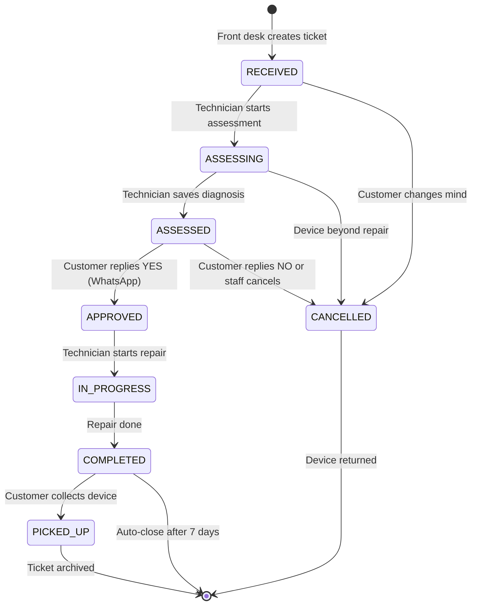
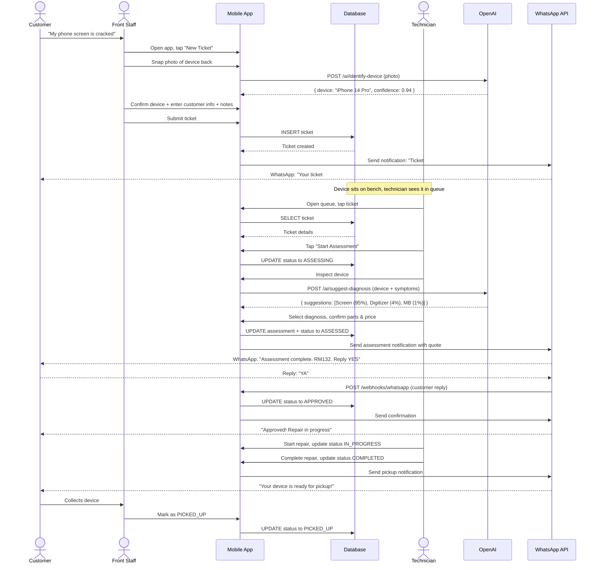
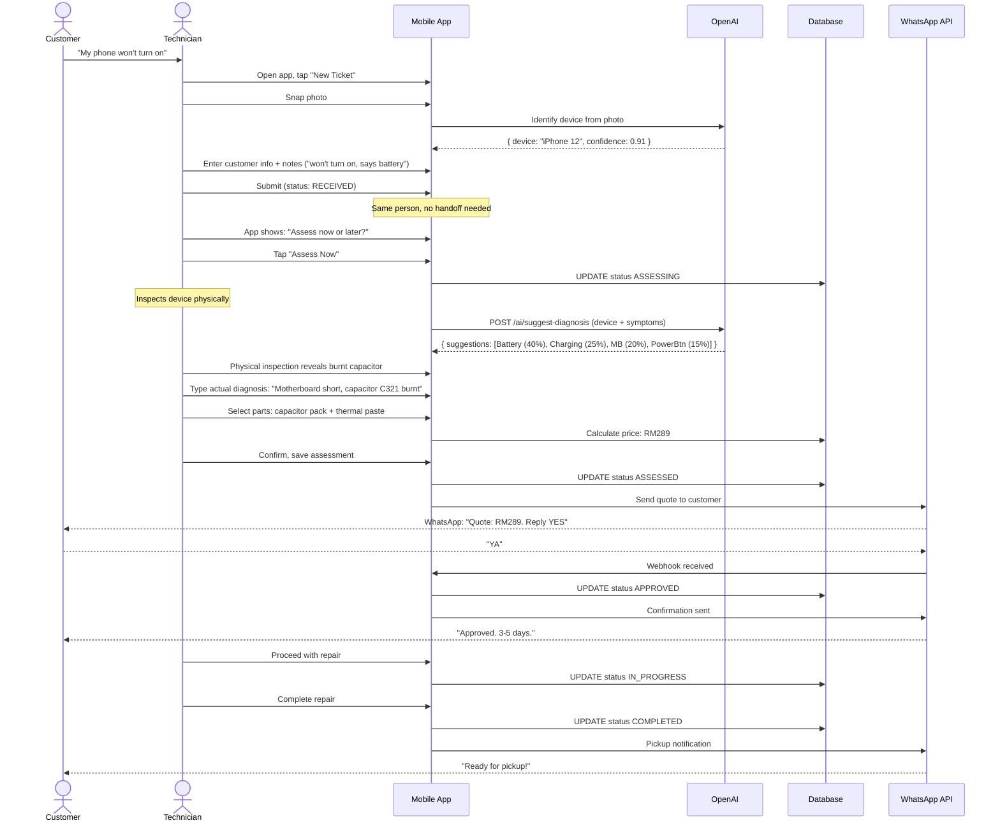
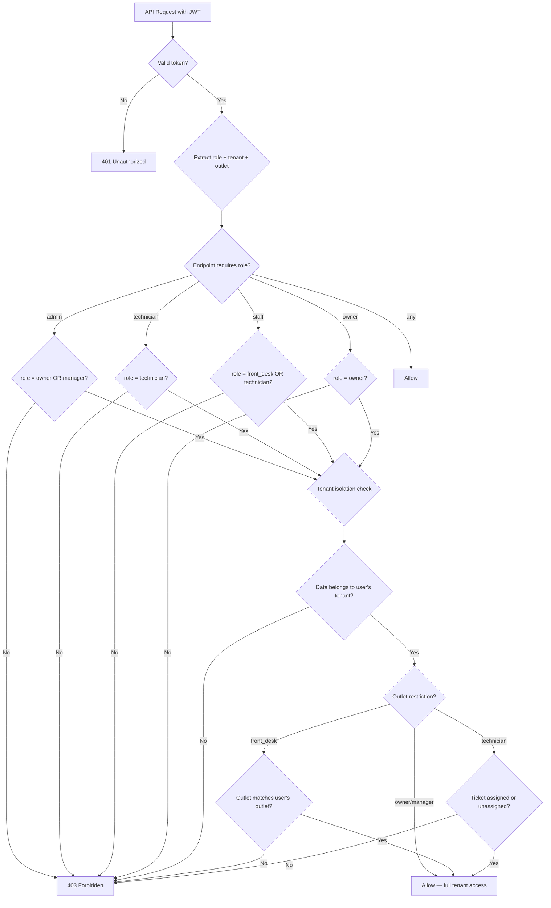

# Flow Diagrams (Mermaid)

These diagrams can be rendered in any Mermaid-compatible viewer (GitHub, VS Code with extension, mermaid.live).

---

## 1. Complete Ticket Lifecycle (State Machine)



---

## 2. Two-Person Flow (Front Desk + Technician)



---

## 3. Single-Person Flow (Technician Does Everything)



---

## 4. WhatsApp Notification Flow

```mermaid
flowchart TD
    A[Customer gives phone number at intake] --> B[System stores number in ticket]
    B --> C{Ticket status change triggers notification?}
    
    C -->|RECEIVED| D[Send: ticket_created<br/>"Tiket #D1-042 dicipta"]
    C -->|ASSESSED| E[Send: assessment_complete<br/>with quote, ask YES/NO]
    C -->|APPROVED| F[Send: approval_confirmed<br/>"Pembaikan dijalankan"]
    C -->|COMPLETED| G[Send: ready_for_pickup<br/>"Sedia untuk diambil"]
    C -->|3 days after COMPLETED| H[Send: pickup_reminder<br/>"Peringatan: belum diambil"]
    
    D --> I[Customer receives WhatsApp]
    E --> J{Customer replies?}
    F --> I
    G --> I
    H --> I
    
    J -->|YES / YA| K[Auto-approve ticket<br/>Update DB: APPROVED]
    J -->|NO / TIDAK| L[Mark declined<br/>Update DB: CANCELLED<br/>Notify staff]
    J -->|Question (contains ?)| M[Forward to staff<br/>app notification<br/>for manual reply]
    J -->|Unrecognized text| N[Forward to staff<br/>for manual review]
    
    K --> O[Send confirmation<br/>"Diluluskan!"]
    L --> P[Send cancellation<br/>"Dibatalkan"]
```

---

## 5. AI Vision + Diagnosis Pipeline

```mermaid
flowchart LR
    A[Staff takes photo] --> B[Compress to 800px max edge]
    B --> C[Upload to Supabase Storage]
    C --> D[Get public URL]
    D --> E[POST /api/ai/identify-device]
    E --> F[OpenAI GPT-4o Vision<br/>"What device is in this photo?"]
    F --> G{Confidence > 0.8?}
    
    G -->|Yes| H[Match to device catalog<br/>by brand + model]
    G -->|No| I[Return "uncertain"<br/>with best guess]
    
    H --> J{Found in catalog?}
    J -->|Yes| K[Return device_id + model + confidence]
    J -->|No| L[Return suggestions +<br/>prompt "add to catalog"]
    I --> M[App shows manual search<br/>with AI guess as hint]
    
    K --> N[Staff confirms or edits device]
    L --> N
    M --> N
    
    N --> O[Staff enters customer notes]
    O --> P[POST /api/ai/suggest-diagnosis]
    P --> Q[OpenAI GPT-4o<br/>"Based on device X and symptoms Y,<br/>suggest likely diagnoses with parts and time"]
    Q --> R[Return ranked suggestions<br/>with parts and labor estimates]
    R --> S[Technician selects + refines]
    S --> T[System auto-fills parts list<br/>and calculates total price]
    T --> U[Technician approves final quote]
    U --> V[WhatsApp notification to customer]
```

---

## 6. Offline Sync Flow (Month 5)

```mermaid
flowchart TD
    A[Staff creates ticket] --> B{Internet available?}
    
    B -->|Yes| C[Normal flow:<br/>POST /api/tickets<br/>Insert to DB]
    B -->|No| D[Store in AsyncStorage<br/>Ticket ID: TMP-001]
    
    D --> E[Show pending sync badge<br/>"4 tiket menunggu sync"]
    
    E --> F{Internet restored?}
    F -->|Yes| G[Background sync process starts]
    F -->|No| E
    
    G --> H[Process TMP tickets<br/>in FIFO order]
    H --> I{Conflict?}
    
    I -->|No| J[POST to API,<br/>convert TMP to real ticket]
    I -->|Yes| K[Show conflict<br/>resolution dialog]
    
    J --> L[Clear from AsyncStorage]
    K --> M[User resolves,<br/>then sync]
    M --> J
    
    L --> N{More TMP tickets?}
    N -->|Yes| H
    N -->|No| O[Sync complete<br/>Hidden badge]
```

---

## 7. Role-Based Authorization


