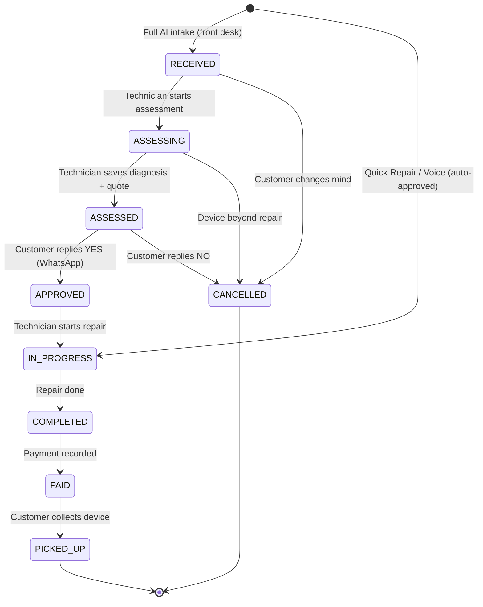

# System Architecture

> **Revision (June 2025):** Single Next.js PWA replaces Expo + Next.js. See `02b-revised-pwa-plan.md` for full rationale and revised plan.

## High-Level Diagram

```
┌─────────────────────────────────────────────────────────────────────────────┐
│                         SINGLE NEXT.JS APPLICATION                           │
│                                                                              │
│  ┌──────────────────────────────────────────────────────────────────────┐   │
│  │                          CLIENT LAYER                                 │   │
│  │                                                                       │   │
│  │  ┌──────────────────────┐  ┌──────────────────┐  ┌────────────────┐  │   │
│  │  │   STAFF PWA          │  │   ADMIN DASHBOARD │  │  PUBLIC VIEW   │  │   │
│  │  │   (Mobile-First)     │  │   (Desktop Web)   │  │  (Lightweight) │  │   │
│  │  │                      │  │                   │  │                │  │   │
│  │  │  Route: / (app)      │  │  Route: /overview │  │  Route:        │  │   │
│  │  │                      │  │                   │  │  /t/[token]    │  │   │
│  │  │  Front desk staff    │  │  Owner/Manager    │  │  View quote    │  │   │
│  │  │  Technicians         │  │  Reports          │  │  Approve/Reject│  │   │
│  │  │  Queue view          │  │  Catalog          │  │  Subscribe WA  │  │   │
│  │  │  Assessment          │  │  Staff mgmt       │  │                │  │   │
│  │  │                      │  │                   │  │                │  │   │
│  │  │  PWA features:       │  │                   │  │                │  │   │
│  │  │  Add to Home Screen  │  │                   │  │                │  │   │
│  │  │  Service Worker      │  │                   │  │                │  │   │
│  │  │  Offline support     │  │                   │  │                │  │   │
│  │  │  WebAuthn biometrics │  │                   │  │                │  │   │
│  │  └──────────┬───────────┘  └──────────┬────────┘  └───────┬────────┘  │   │
│  │             │                         │                    │           │   │
│  │             └─────────────┬───────────┴────────────────────┘           │   │
│  │                           │                                             │   │
│  │                    ┌──────┴──────┐                                      │   │
│  │                    │  API LAYER  │                                      │   │
│  │                    │  Next.js    │                                      │   │
│  │                    │  Route      │                                      │   │
│  │                    │  Handlers   │                                      │   │
│  │                    └──────┬──────┘                                      │   │
│  │                           │                                             │   │
│  │        ┌──────────────────┼──────────────────┐                          │   │
│  │        ▼                  ▼                  ▼                          │   │
│  │  ┌───────────┐     ┌──────────────┐     ┌──────────────┐                │   │
│  │  │  AI       │     │  CORE        │     │  EXTERNAL    │                │   │
│  │  │  SERVICE  │     │  SERVICES    │     │  SERVICES    │                │   │
│  │  │           │     │              │     │              │                │   │
│  │  │ OpenAI    │     │ Auth         │     │ WhatsApp     │                │   │
│  │  │ GPT-4o    │     │ (Supabase)   │     │ Business API │                │   │
│  │  │ Vision    │     │              │     │ (360dialog)  │                │   │
│  │  │ GPT-4o    │     │ Notifications│     │              │                │   │
│  │  │ Text      │     │ (Queue)      │     │              │                │   │
│  │  │ Whisper   │     │ File Storage │     │              │                │   │
│  │  │           │     │ (Supabase)   │     │              │                │   │
│  │  └───────────┘     └──────┬───────┘     └──────────────┘                │   │
│  │        │                  │                   │                         │   │
│  │        └──────────────────┼───────────────────┘                         │   │
│  │                           ▼                                             │   │
│  │                    ┌──────────────┐                                     │   │
│  │                    │   DATABASE   │                                     │   │
│  │                    │  PostgreSQL  │                                     │   │
│  │                    │  (Supabase)  │                                     │   │
│  │                    │              │                                     │   │
│  │                    │  Real-time   │                                     │   │
│  │                    │  subscriptions                                    │   │
│  │                    └──────────────┘                                     │   │
│  └──────────────────────────────────────────────────────────────────────┘   │
└─────────────────────────────────────────────────────────────────────────────┘
```

## Staff Notification Strategy

Three layers, no native push notifications required:

### Layer 1: Real-Time Queue (in-app, primary)
```
STAFF PWA OPEN ──▶ Supabase Realtime WS ──▶ New ticket appears in queue instantly
                                           Status changes update live
                                           Optional sound cue for new assignments
```

### Layer 2: WhatsApp Fallback (out-of-app)
```
TICKET ASSIGNED ──▶ 360dialog ──▶ WhatsApp msg to technician
                                  "Tiket baru #D1-042: iPhone 14 Pro — Skrin Pecah."
```

### Layer 3: Web Push (future, v2+)
```
APP CLOSED ──▶ Service Worker ──▶ Web Push notification
                                  (iOS Safari 16.4+, Chrome)
```

## Data Flow: Graduated Intake (3 Tiers)

### Tier 1: Voice Intake (<5 seconds)

```
STAFF     ──▶   TAP 🎤   ──▶   SPEAK    ──▶   AI        ──▶   CONFIRM   ──▶   TICKET
OPENS           MIC          "iPhone          PARSE         (1 tap)         CREATED
APP             BUTTON        14 Pro,         VOICE TO                      (auto-
(WEB)                         skrin           FIELDS                        approved)
                              pecah,         (Whisper +
                              RM350"         GPT-4o)
```

### Tier 2: Quick Repair (<10 seconds)

```
STAFF     ──▶   TYPE     ──▶   SELECT   ──▶   TAP       ──▶   TICKET
OPENS          "iPh..."        "Skrin         QUICK            CREATED
APP            (3 chars)       Pecah"         SUBMIT           (auto-
               → iPhone        (top-10        (price           approved,
               14 Pro          common         auto-filled      in_progress)
               auto-match)     issues)        from catalog)
```

### Tier 3: Full AI Intake (30-90 seconds)

```
STAFF     ──▶   PHOTO   ──▶   AI     ──▶   MATCH   ──▶   TICKET
OPENS          CAPTURE       VISION        CATALOG        CREATED
APP                           API
(WEB)                         │
CUSTOMER  ◀──  WHATSAPP  ◀──  NOTIF   ◀──  SAVE    ◀────┘
GETS            API            SERVICE       TO DB
WHATSAPP
```

## Data Flow: Payment & Receipt

```
TECH       ──▶   TAP        ──▶   PAYMENT   ──▶   CONFIRM   ──▶   PARTS
MARKS            "SELESAI"        SCREEN          PAYMENT         DECREMENTED
COMPLETE         (status:         SLIDES UP       (cash/QR/       INVENTORY
                 completed)       auto-filled     bank)
                                  amount,
                                  select method
                                                        │
                                          ┌─────────────┴──────────────┐
                                          │                            │
                                    PHONE PROVIDED?              NO PHONE?
                                          │                            │
                                    ┌─────▼─────┐              ┌──────▼──────┐
                                    │ WHATSAPP  │              │ QR RECEIPT  │
                                    │ RECEIPT   │              │ SCREEN      │
                                    │ SENT      │              │ (scan to    │
                                    └───────────┘              │  subscribe) │
                                                               └─────────────┘
```

## Data Flow: Technician Assessment

```
TECH      ──▶   OPEN    ──▶   AI       ──▶   TECH     ──▶   SAVE     ──▶   WHATSAPP
OPENS           TICKET         DIAGNOSE        SELECTS        ASSESS          TO CUST
QUEUE                          API             DIAGNOSIS      MENT            (QUOTE)
(WEB)

                                                                                   │
                                                                          ┌────────┴────────┐
                                                                          │ CUSTOMER         │
                                                                          │ REPLIES YES/NO   │
                                                                          │ (WhatsApp)       │
                                                                          └─────────────────┘
```

## Real-Time Queue

Supabase Realtime broadcasts ticket status changes to all connected PWA clients:

```
┌─────────────────┐         ┌──────────────────┐         ┌─────────────────┐
│  TECHNICIAN     │◀────────│    SUPABASE      │◀────────│   FRONT DESK    │
│  PHONE          │  WS PUSH│    REALTIME      │  UPDATE │   CREATES       │
│  (PWA, listens) │         │  (Postgres       │         │   TICKET        │
│                 │         │   changes)       │         │   (PWA)         │
└─────────────────┘         └──────────────────┘         └─────────────────┘
```

## Role-Aware Unified Flow

Any user can advance a ticket through any state based on their role.
Quick Repair and Voice Intake tickets skip assessment and auto-approve.



**Quick Repair / Voice Intake path:**

- Skips `received` → `assessing` → `assessed` → approval
- Goes directly to `in_progress` (auto-approved, technician already verified at counter)
- Payment recorded at `completed`, then `paid`, then `picked_up`

**Full AI path:**

- Front desk staff receives device, technician assesses, customer must approve via WhatsApp before repair begins

## Compressed Flow (Technician as Front Desk)

When a technician handles intake directly, the flow adapts to how well they already know the fix:

| Fix Known?                   | Path                  | Steps                                                                                                                                                          | Time    |
| ---------------------------- | --------------------- | -------------------------------------------------------------------------------------------------------------------------------------------------------------- | ------- |
| Yes (known fix, known price) | Quick Repair or Voice | 1. Tap "Baiki Cepat" or 🎤 → 2. Speak/typeahead device + issue → 3. Confirm → ticket auto-approved, in progress                                                | <10 sec |
| No (needs diagnosis)         | Full AI               | 1. Snap photo → AI ID → 2. Enter customer info → 3. Submit → 4. "Assess Now?" → 5. AI-suggested diagnosis → 6. Parts + pricing → 7. Save → WhatsApp quote sent | 1-3 min |

## Key Architecture Principles

1. **Stateless API**: Each request is self-contained; no server-side sessions.
2. **Database as source of truth**: All ticket state in PostgreSQL; real-time broadcasts for live updates.
3. **AI as a service**: OpenAI calls are isolated behind `/api/ai/*` endpoints; easy to swap models later.
4. **File storage separation**: Photos stored in Supabase Storage, DB holds URLs only.
5. **Idempotent notifications**: WhatsApp message deduplication via external_message_id.
6. **Graceful degradation**: If AI API is down, fall back to manual device selection and diagnosis entry.
7. **PWA-first**: Single codebase serves staff app, admin dashboard, and public views. Service Worker enables offline use.
8. **WhatsApp as notification channel**: Both customer and staff notifications via WhatsApp. No push notification infrastructure needed.
